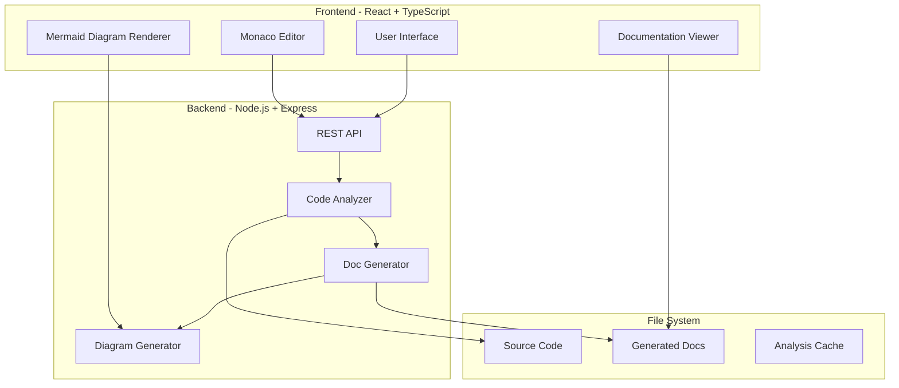
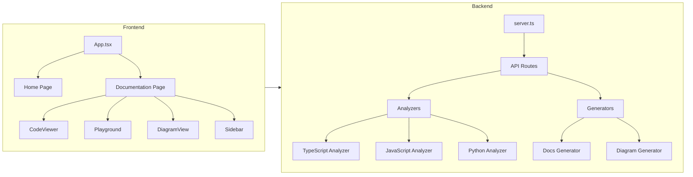
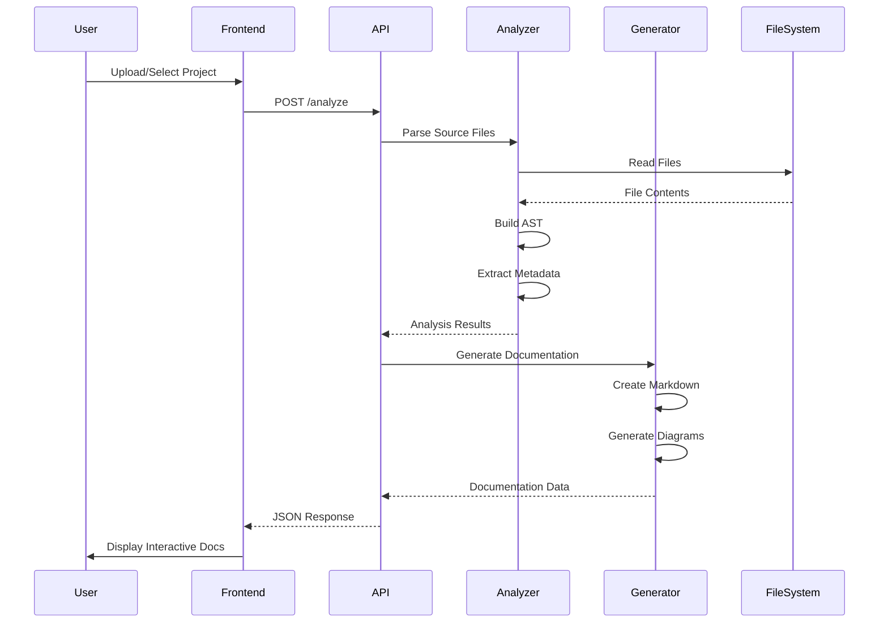
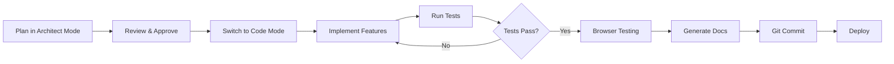

# CodeLens - AI-Powered Interactive Documentation Generator
## Complete Architecture & Implementation Plan

---

## 🎯 Project Overview

**CodeLens** is a sophisticated documentation generator that analyzes codebases and creates beautiful, interactive documentation with live code examples, architecture diagrams, and AI-powered insights. This project showcases the full capabilities of the IDE including multi-file operations, code analysis, web development, browser automation, and git integration.

---

## 🏗️ System Architecture

### High-Level Architecture



### Component Architecture



### Data Flow



---

## 📁 Project Structure

```
codelens/
├── backend/
│   ├── src/
│   │   ├── analyzers/
│   │   │   ├── base.analyzer.ts          # Base analyzer interface
│   │   │   ├── typescript.analyzer.ts    # TypeScript/TSX analyzer
│   │   │   ├── javascript.analyzer.ts    # JavaScript/JSX analyzer
│   │   │   ├── python.analyzer.ts        # Python analyzer
│   │   │   └── ast.parser.ts             # AST parsing utilities
│   │   ├── generators/
│   │   │   ├── docs.generator.ts         # Main documentation generator
│   │   │   ├── diagram.generator.ts      # Mermaid diagram generator
│   │   │   ├── example.extractor.ts      # Code example extractor
│   │   │   └── markdown.builder.ts       # Markdown builder utility
│   │   ├── api/
│   │   │   ├── routes.ts                 # API route definitions
│   │   │   ├── analyze.controller.ts     # Analysis endpoints
│   │   │   └── export.controller.ts      # Export endpoints
│   │   ├── utils/
│   │   │   ├── file.utils.ts             # File system utilities
│   │   │   ├── cache.manager.ts          # Caching layer
│   │   │   └── logger.ts                 # Logging utility
│   │   ├── types/
│   │   │   └── index.ts                  # TypeScript type definitions
│   │   └── server.ts                     # Express server setup
│   ├── tests/
│   │   ├── analyzers/
│   │   ├── generators/
│   │   └── api/
│   ├── package.json
│   ├── tsconfig.json
│   └── .env.example
├── frontend/
│   ├── src/
│   │   ├── components/
│   │   │   ├── CodeViewer.tsx            # Syntax-highlighted code display
│   │   │   ├── DiagramView.tsx           # Mermaid diagram renderer
│   │   │   ├── Playground.tsx            # Interactive code editor
│   │   │   ├── Sidebar.tsx               # Navigation sidebar
│   │   │   ├── SearchBar.tsx             # Documentation search
│   │   │   ├── ExportMenu.tsx            # Export options menu
│   │   │   └── LoadingSpinner.tsx        # Loading indicator
│   │   ├── pages/
│   │   │   ├── Home.tsx                  # Landing page
│   │   │   ├── Documentation.tsx         # Main documentation view
│   │   │   └── Settings.tsx              # Configuration page
│   │   ├── hooks/
│   │   │   ├── useCodeAnalysis.ts        # Code analysis hook
│   │   │   ├── useDocumentation.ts       # Documentation data hook
│   │   │   └── useTheme.ts               # Theme management hook
│   │   ├── services/
│   │   │   ├── api.service.ts            # API client
│   │   │   └── storage.service.ts        # Local storage wrapper
│   │   ├── styles/
│   │   │   └── globals.css               # Global styles + Tailwind
│   │   ├── types/
│   │   │   └── index.ts                  # TypeScript types
│   │   ├── utils/
│   │   │   └── helpers.ts                # Utility functions
│   │   ├── App.tsx                       # Main app component
│   │   └── main.tsx                      # Entry point
│   ├── public/
│   │   ├── index.html
│   │   └── assets/
│   ├── tests/
│   │   ├── components/
│   │   └── e2e/
│   ├── package.json
│   ├── tsconfig.json
│   ├── vite.config.ts
│   └── tailwind.config.js
├── docs/
│   ├── API.md                            # API documentation
│   ├── ARCHITECTURE.md                   # This file
│   └── CONTRIBUTING.md                   # Contribution guidelines
├── scripts/
│   ├── setup.sh                          # Initial setup script
│   └── test-e2e.ts                       # E2E test runner
├── .gitignore
├── README.md
└── package.json                          # Root package.json for monorepo
```

---

## 🔧 Technology Stack

### Backend
- **Runtime**: Node.js 20+
- **Framework**: Express.js
- **Language**: TypeScript
- **Code Analysis**: 
  - `@babel/parser` - JavaScript/TypeScript AST parsing
  - `@typescript-eslint/parser` - TypeScript analysis
  - `acorn` - Fast JavaScript parser
- **Diagram Generation**: `mermaid` (server-side rendering)
- **File Processing**: `glob`, `fast-glob`
- **Testing**: Jest, Supertest

### Frontend
- **Framework**: React 18
- **Language**: TypeScript
- **Build Tool**: Vite
- **Styling**: Tailwind CSS
- **Code Editor**: Monaco Editor (VS Code's editor)
- **Syntax Highlighting**: Prism.js
- **Diagram Rendering**: Mermaid
- **Animations**: Framer Motion
- **State Management**: Zustand
- **HTTP Client**: Axios
- **Testing**: Vitest, React Testing Library, Puppeteer

### Development Tools
- **Linting**: ESLint
- **Formatting**: Prettier
- **Git Hooks**: Husky
- **Package Manager**: npm or pnpm

---

## 🎨 Key Features

### 1. Smart Code Analysis
- Multi-language support (TypeScript, JavaScript, Python)
- AST-based parsing for accurate analysis
- Dependency graph generation
- Complexity metrics (cyclomatic complexity, LOC)
- Export/import relationship mapping

### 2. Interactive Documentation
- Live code examples with syntax highlighting
- Editable code playground (Monaco Editor)
- Real-time preview
- Copy-to-clipboard functionality
- Search and filter capabilities
- Breadcrumb navigation

### 3. Visual Architecture
- Auto-generated Mermaid diagrams:
  - Component relationship graphs
  - Data flow diagrams
  - Class hierarchies
  - Call graphs
- Interactive diagram exploration
- Zoom and pan capabilities

### 4. AI-Powered Insights
- Automatic function/class summaries
- Usage example generation
- Best practices suggestions
- Code smell detection
- Complexity warnings

### 5. Export & Sharing
- Static HTML export (single file)
- PDF generation
- Markdown output
- JSON API for integration
- Shareable links with state

### 6. Developer Experience
- Dark/light theme toggle
- Responsive design (mobile-friendly)
- Keyboard shortcuts
- Customizable templates
- Configuration presets

---

## 🚀 Implementation Phases

### Phase 1: Backend Foundation
1. Set up Express server with TypeScript
2. Implement file system utilities
3. Create base analyzer interface
4. Build TypeScript analyzer
5. Add caching layer
6. Create REST API endpoints

### Phase 2: Documentation Generation
1. Implement documentation generator
2. Build Mermaid diagram generator
3. Create example extractor
4. Add markdown builder
5. Implement export functionality

### Phase 3: Frontend Core
1. Set up React + Vite + TypeScript
2. Configure Tailwind CSS
3. Create basic layout and routing
4. Implement API service layer
5. Build state management

### Phase 4: Interactive Components
1. Integrate Monaco Editor
2. Build code viewer component
3. Create diagram renderer
4. Implement playground
5. Add search functionality

### Phase 5: Polish & Testing
1. Write unit tests (Jest/Vitest)
2. Implement E2E tests (Puppeteer)
3. Add animations and transitions
4. Optimize performance
5. Create comprehensive documentation

### Phase 6: Advanced Features
1. Add Python analyzer
2. Implement git integration
3. Create deployment configuration
4. Add CI/CD pipeline
5. Generate meta-documentation

---

## 🎯 IDE Capabilities Demonstrated

### File Operations
- ✅ Reading multiple files recursively
- ✅ Writing generated documentation
- ✅ Creating complex directory structures
- ✅ File pattern matching and filtering

### Code Intelligence
- ✅ AST parsing and analysis
- ✅ Code definition extraction
- ✅ Dependency graph generation
- ✅ Cross-file reference tracking

### Web Development
- ✅ Full-stack application architecture
- ✅ Modern React patterns (hooks, context)
- ✅ TypeScript type safety
- ✅ Responsive UI design

### Browser Automation
- ✅ Automated testing with Puppeteer
- ✅ Screenshot capture
- ✅ User interaction simulation
- ✅ Console log monitoring

### Git Integration
- ✅ Diff generation
- ✅ Commit tracking
- ✅ Branch management
- ✅ PR description generation

### Multi-Mode Workflow
- ✅ Planning in Architect mode
- ✅ Implementation in Code mode
- ✅ Testing and validation
- ✅ Documentation generation

---

## 📊 Success Metrics

### Technical Excellence
- 90%+ test coverage
- Sub-second analysis for small projects
- <100ms UI response time
- Zero critical security vulnerabilities

### User Experience
- Intuitive navigation
- Beautiful, modern design
- Smooth animations
- Accessible (WCAG 2.1 AA)

### Documentation Quality
- Comprehensive API docs
- Clear architecture diagrams
- Usage examples for all features
- Self-documenting (meta!)

---

## 🔄 Development Workflow



---

## 🎓 Learning Outcomes

By building this project, you'll demonstrate:

1. **Architecture Skills**: Designing scalable full-stack applications
2. **Code Quality**: Writing clean, testable, maintainable code
3. **Modern Tools**: Using cutting-edge frameworks and libraries
4. **Testing**: Comprehensive unit, integration, and E2E testing
5. **DevOps**: CI/CD, deployment, and monitoring
6. **Documentation**: Creating professional technical documentation
7. **UX Design**: Building intuitive, beautiful interfaces

---

## 🚦 Next Steps

1. **Review this architecture plan** - Ensure it meets your requirements
2. **Approve the technology stack** - Confirm all choices work for you
3. **Switch to Code mode** - Begin implementation
4. **Iterate and refine** - Build incrementally with testing

---

## 💡 Why This Project is Perfect

### Demonstrates IDE Strengths
- Multi-file operations at scale
- Complex code analysis
- Real-time browser interaction
- Git workflow integration
- Mode collaboration

### Real-World Value
- Solves actual developer pain points
- Production-ready architecture
- Extensible and maintainable
- Portfolio-worthy

### Technical Depth
- Advanced TypeScript patterns
- AST manipulation
- Performance optimization
- Security best practices

### Visual Impact
- Beautiful, modern UI
- Interactive elements
- Smooth animations
- Professional polish

---

**Ready to build something amazing? Let's switch to Code mode and start implementing!** 🚀